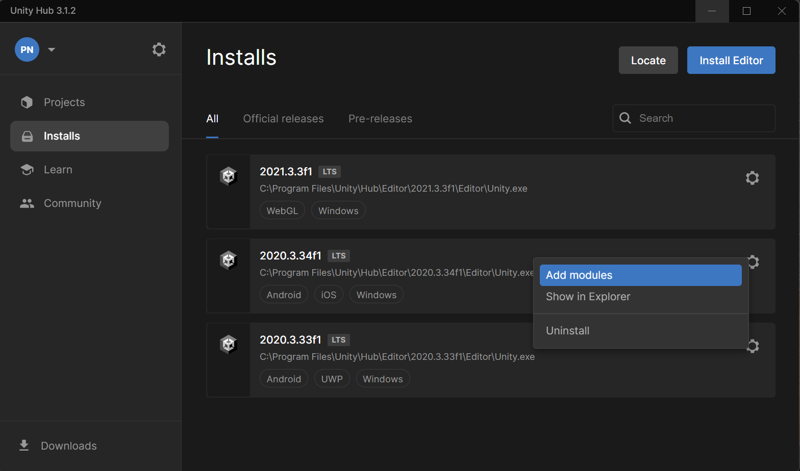

# Starting and configuring a new Unity project

We'll start by creating a new Unity project and configuring it for Windows Mixed Reality development.  

# Create a new Unity project

1. Launch the **Unity Hub**.

2. In the **Projects** tab, click **New Project**.

3. Click the drop-down under **New project** and select the appropriate editor version (Unity 2020.3 LTS).

4. Ensure the chosen template is **3D Core** or **3D Sample Scene (URP)**.

    >[!Note]
    >Creating your project using 3D Sample Scene (URP) may help increase the performance of your application.

5. In the **Project name** box, enter a name for your project--for example, "MRTKV3_Showroom."

6. In the **Location** box, click the folder icon, and then navigate to the folder where you want to save your project or create a new folder.

7. Click **Create Project**. This opens your project in Unity.

    >[!Caution]
    >When working on Windows, there is a file path limit of 255 characters. Unity may fail to compile your app if any file path is longer than 255 characters.

## Import the MRTK3 unity package

To import the Mixed Reality Toolkit into your project we'll use the Mixed Reality Feature Tool, which allows developers to discover, update, and import mixed reality feature packages.

1. Download the latest version of the Mixed Reality Feature Tool from the [Microsoft Download Center](https://aka.ms/MRFeatureTool).

2. Unzip the folder and double click **MixedRealityFeatureTool.exe** to launch the Mixed Reality Feature Tool.

    

3. In the Mixed Reality Feature Tool, select **Start**.

    

4. To access the **MRTK3 preview packages**, click on the **settings icon** at the bottom-left of the window. Switch to the **Feature** tab and ensure that **Show preview releases** is checked.

    

5. Click on **Ok** to apply the settings.

6. Select the browse button (button highlighted with a red box in the image below), then navigate to your project and open it.

    

    >[!Note]
    >The Project Path box in the Tool must contain some value, so it inserts a backslash ("_") by default.

7. After you select a folder, the tool checks to ensure that you have selected a folder that contains a valid Unity project. 

8. Select **Discover Features**.

    

    >[!Note]
    >You may need to wait a few seconds while the Tool refreshes the packages from the feeds.

9. On the **Discover Features** page, note that there is a list of seven package groups.

    

10. Click the "+" button next to **MRTK3 (0 of 13)** and then click on **Select All**

    

    >[!Note]
    >The Mixed Reality Toolkit Foundation package is the primary package that must be imported and configured in order to use MRTK with your project. This package includes the core components required to create a mixed reality application.

11. Click the "+" button to the left of **Platform Support (0 of 5)** and then select the latest version of **Mixed Reality OpenXR Plugin**.

    

12. After you've made your selection(s), click **Get Features**.

13. Select **Validate** to validate the packages you selected. You should see a dialog that says **No validation issues** were detected. When you do, click **OK**.

14. On the **Import Features** page, the left-side column, the **Features** displays the packages you just selected. The right-side column shows the **required dependencies** displays any dependencies. You can click the **Details** link for any of these items to learn more about them.

15. When you're ready to move on, select **Import**. On the **Review and Approve** page, you can review information about the packages.

16. Select **Approve**.

17. Return to the Unity Editor. You'll see a progress bar showing you that your packages are being imported. You may need to click anywhere in the Unity window in order to trigger the package import if you do not see the progress bar.

## Configure the unity project

1. After Unity has imported the packages, a warning appears asking if you want to enable the backends by restarting the editor. Select **Yes**.

    

2. You will encounter another warning asking if you have created a backup. Click on **I Made a Backup, Go Ahead!** Wait for the project to **restart**.

    

3. In the menu bar, select **File** > **Build Settings**. If you see an OpenXR Project Validation window or pop-up warning with issues, feel free to ignore the warning as it will be addressed later in this tutorial.

4. In the **Build Settings** window, select **Universal Windows Platform** and click on **Switch Platform**. Follow the instructions below if you do not have the **Universal Windows Platform** module installed in Unity. If you do, feel free to skip to Step 5.

    

    >[!Note]
    >To have the Universal Windows Platform option enabled in the Build Settings Window, ensure that Universal windows platform is checked while you download the respective unity version through Unity Hub

    - Click on **settings** of the respective version, then select **Add modules**.

        

    - Now ensure that **Universal Windows Platform Build Support** is **checked**, then click **Install**.

        
    >[!Note]
    >To reload the packages and avoid errors, close and re - open the project.

5. Navigate to **Edit** > **Project settings**. Ensure that you're on the **XR Plug-in Management** section with the **Universal Windows Platform** settings (Windows logo tab) displayed.

    

6. Select **OpenXR** and wait for the packages to install. There may be a yellow warning triangle next to OpenXR. Hover your cursor over the triangle if you wish to read the message in the popup, and then select the triangle to open the OpenXR Project Validation window.

    

7. In the **OpenXR Project Validation window**, there are several issues listed. Select the Fix All button. If you see an issue stating that "at least one interaction profile must be added", feel free to ignore this as this will be covered over the next few steps.

    

8. Check the **Microsoft HoloLens feature group** checkbox.

    

9. Select the **OpenXR** submenu that is under the XR Plug-in Management menu item, as indicated in the figure. In the **Interaction Profiles** section, select the plus sign (+) button three times, each time choosing one of the following profiles:

    - Eye Gaze Interaction Profile
    - Microsoft Hand Interaction Profile
    - Microsoft Motion Controller Profile

    

10. If the **Eye Gaze Interaction Profile**, or any other profile, appears with a yellow triangle next to it, select the triangle, and then in the **OpenXR Project Validation window**, click the **Fix** button. When you're finished, close the **OpenXR Project Validation window**

    

11. Click the **Depth Submission Mode** drop down and then select **Depth 16 Bit**.

    

## Configure MRTK3 Profile

1. In the **Project settings** window, click on **MRTK3** option.

    

2. Click on the **circular icon** next to the profile field that says **None (MRTK Profile)** to assign the MRTK profile. In the **Select MRTK Profile** window that appears, click on the eye icon to show the hidden items, and select the **MRTKProfile**.

    

3. After selecting the profile named MRTKProfile, you may close the Select **MRTK Profile** window. Your MRTK3 section in the **Project Settings** should look like the image below.

    

    >Note
    >Once the MRTK settings are completed the errors in the console can be cleared.

## Create the scene and configure MRTK

1. In the menu bar, select **File** > **New Scene**.

2. In the New Scene window select **Basic (Built-in)** and then click **Create**. Save the new scene with a name of your choice.

3. Delete the **main camera** from the scene.

4. Now, in the **project window**, search for **MRTK XR Rig** and **MRTK Input Simulator** and  drag and drop it to the **hierarchy** window. If your search results are not returning any items, ensure that you are searching for **All** items, as the search filter (usually located under the search bar) may be set to **In Assets** by default.  Configure the Transform component of each prefab as follows:

    - Position: X = 0, Y = 0, Z = 0
    - Rotation: X = 0, Y = 0, Z = 0
    - Scale: X = 1, Y = 1, Z = 1

        

## Installing URP

1. In **Menu Bar** navigate to **Window** > **Package Manager** and install the latest version of **Universal Render Pipeline**, which may appear listed as **Universal RP**. If you created your Unity project with Universal Render Pipeline previously, then this package may already be installed.

2. Now to create the **URP pipeline asset**, in **Project window** right-click on Asset and navigate to **Create** > **Rendering** > **Universal Render Pipeline** > **Pipeline Asset (Forward Renderer)**. The default name for this asset will be UniveralRenderPipelineAsset.

3. Configure the Project settings by navigating to **Edit** > **Project settings** > **Graphics**. In **Scriptable Render pipeline settings**, click on the radio button and choose **Universal Render Pipeline Asset** (If you changed the default name of the asset in the previous step, then choose the asset with the name that you used in the previous step.).

## Import the virtual showroom Unity package

To get started, first download the following **Unity custom package**: [MR_RetailShowroom](https://veerubytech-my.sharepoint.com/:u:/g/personal/trupthi_veeruby_com/ESble4I0ScZIgWjfWFEdL_QB7_BIu_Gto47qo49k4j7__g?download=1)

1. In the Unity menu, select **Assets** > **Import Package** > **Custom Package....**

2. In **Import package**, select the custom unity package that you downloaded, and then select **Open**.

3. In **Import Unity Package** windows, select ensure that all the assets will be imported. Then select **Import**.

    >[!Note]
    >You may click clear or ignore on any warnings that may appear during the import.

4. In the Assets folder, click on the **MR_RetailShowroom** folder, then open the **prefab** folder and drag and drop the **Retail Dress Showroom** model to **hierarchy** window and configure the transform component of this prefab as follows:

    - **Position**: X = 26.6, Y = -5.1, Z = 12.2
    - **Rotation**: X = 0, Y = 0, Z = 0
    - **Scale**: X = 0.83, Y = 0.83, Z = 0.83

    > [!Note]
    > When in game mode, ignore the index out of range error as it appears recursively.

5. In the Hierarchy window, expand **MRTK XR Rig** > **Camera Offset** > **Main camera**. In the inspector window of the **Main Camera**, navigate to **Camera** > **Rendering** > **Post processing** and select the checkbox as shown in the figure. This step is optional, but provides enhanced visual effects for the imported showroom. 

    
