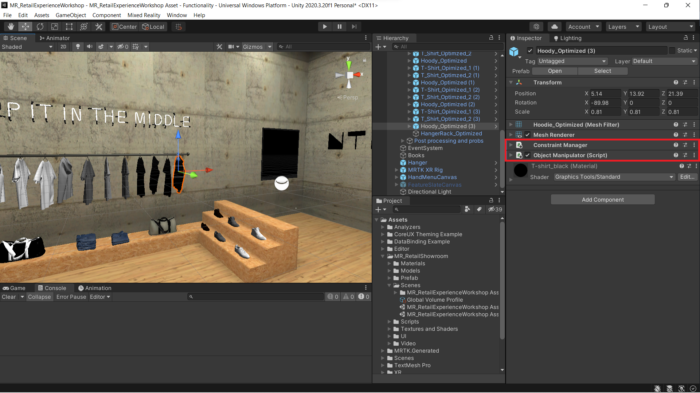
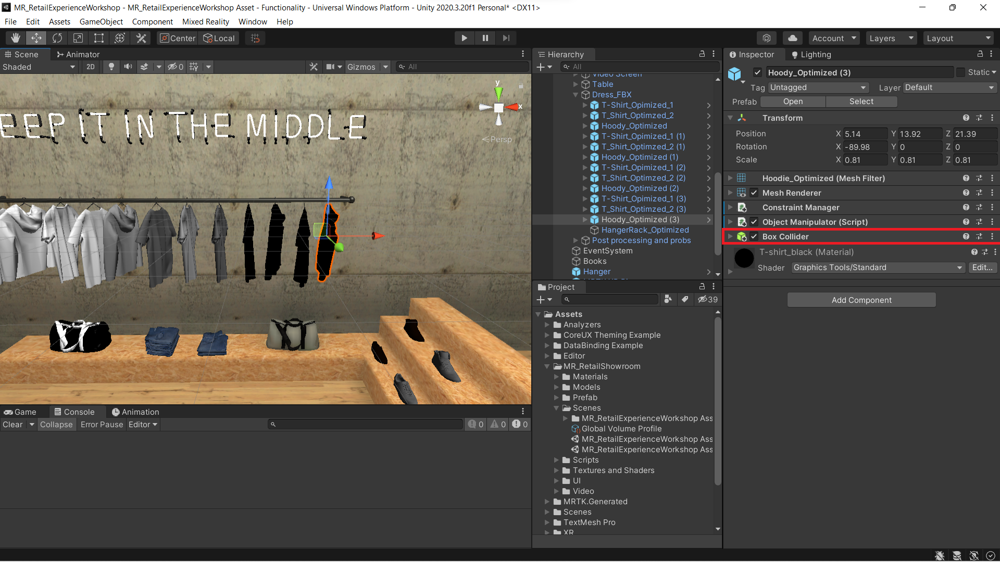
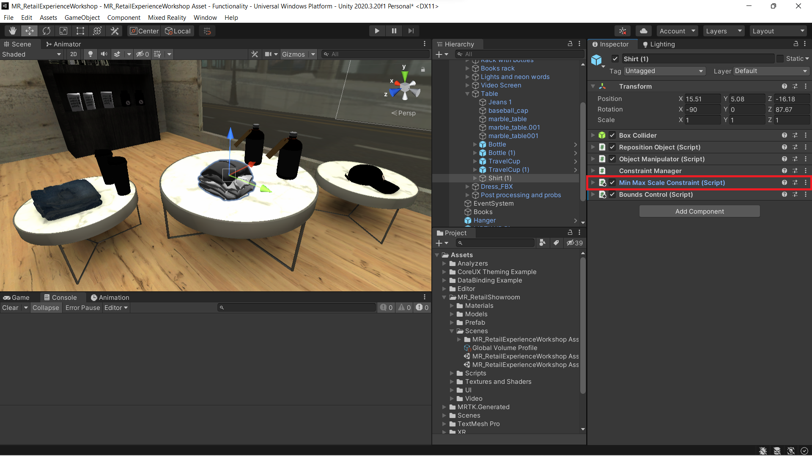
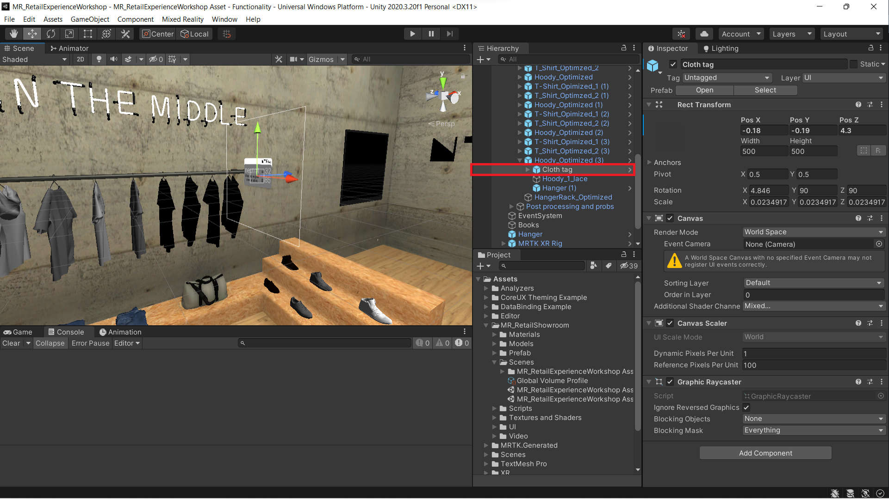
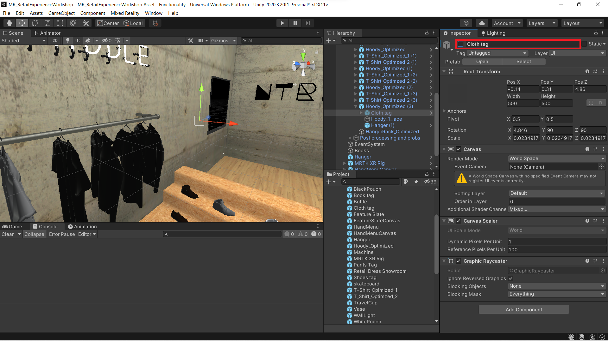
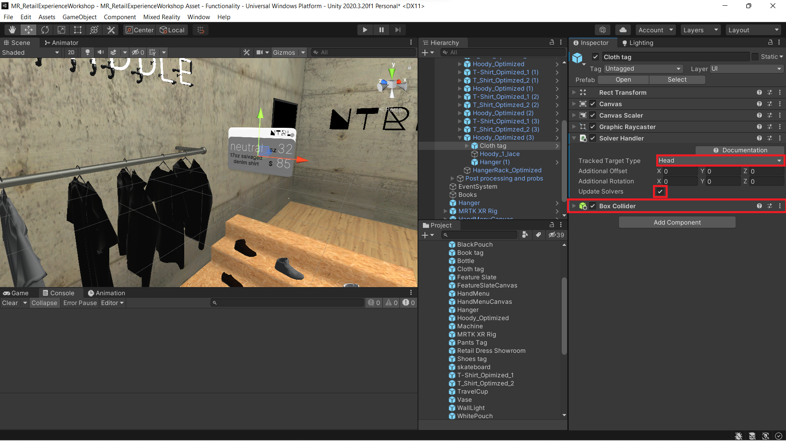

### [Previous Section: Starting and Configuring a New Unity Project](2-setup-unity-project.md)

# Configure Your Virtual Showroom With Interactivity

1. The instructions below demonstrate how to add the ability to manipulate certain objects in your scene with your hands (or controllers on VR devices.) This will allow you to move, rotate, and scale these objects, depending on the types of manipulations you set on those objects.

    - In the hierarchy window, **Retail Dress Showroom** > **Dress_FBX**, select the GameObject called **Hoodie_Optimized (3)**. Now in the inspector window click the **Add Component** button, then search for and select the **ObjectManipulator** script.

    - The **ObjectManipulator** script makes an object movable, scalable, and rotatable using one or two hands. When you add the Object Manipulator script, the **Constraint Manager** script is automatically added as well because the Object Manipulator script depends on it.

        

    - Next, follow the same procedure to add the **Box Collider** component.

        

2. In the hierarchy window, expand **Retail Dress Showroom** > **Table**. Then, select the GameObject named **Shirt (1)** to add the Bounds Control Script to make the GameObject "Scalable". With the game object still selected in the **Hierarchy** window, click on the **Add Component** button and select **Bounds Control**.

    

3. If not already completed, follow the same procedure to add the **Box Collider** component.
    

4. Also, add the **Min Max Scale Constraint** Script to the GameObject. This is a convenient component to constrain scaling to a minimum and maximum size that is customizable.

    

## Include UX elements

Here we plan to integrate the product details into a **UX Slate** and display it along with the product. This will provide an intuitive way for users to learn more about the products in our virtual showroom. 

1. In the **Project window**, navigate to the **Assets** > **MR_RetailShowroom** > **Prefabs** folder, click-and-drag the **Cloth Tag** prefab onto the **Hoodie_Optimized (3)** Gameobject we worked with previously.

    - Drag and drop the **Cloth tag** onto the GameObject Hoodie_Optimzed (3) to make it, its **child** as shown below.

        

    - You may be prompted to install TMP(TextMeshPro) in a pop-up window. Make sure to click Import TMP Essentials and close the pop-up window.

        

2. Adjust the transform component of the UI tag to place it near the product (Hoodie_Optimzed (3)). This may involve moving, scaling, and rotating the product tag so that it can be read by the user.

3. We would like to have the UI tag appear when the user is interacting with the product and hidden when the user is not interacting with the product. To automatically activate and deactivate the tags, follow the instructions below.  

    - In the **Inspector window** of the **Hoodie_Optimzed (3)** GameObject, expand the **Object Manipulator** script to configure the **Manipulation Started** event by clicking on the + icon to add new event.

    - Drag and drop the child **Cloth UI Tag** to the empty field as shown in the figure below.

    - From the dropdown list that says **No Function**, select **GameObject** > **SetActive (bool)** to set this function as the action to be run when the event is triggered. Ensure that the argument checkbox is **checked**.

        

    - Follow the same procedure for the **Manipulation Ended** event. Ensure that the argument checkbox is **unchecked**.

        

     -  Select the **Cloth tag** in hierarchy. In the **Inspector** window, ensure the Cloth tag is **unchecked** as shown in the image below. This makes the tag inactive by default, so that it is not seen before a user's interaction.

        

4. To reposition the product to its original position after interactions, click on the Hoodie_Optimzed (3) GameObject and in the Inspector window, select the **Add Component** button and add the **Reposition Object** script.  

    - In the Inspector window, go to the **Object Manipulator** component’s **Manipulation Ended** event and press the (+) button to add an additional event.  

    - Drag and drop the Hoodie_Optimzed (3) prefab into the empty object field.

    - From the **No Function** dropdown list, and select **RepositionObject** > **ProductLeft()** as shown in the image below.

        

## Using Solvers

Wouldn't it be convenient if the UI Tags followed you around, rather than being pinned in place? Follow the instructions below to attach a solver to the UI cards in order to have them naturally follow you.  

1. In the **Hierarchy** window, select the Cloth UI Tag under the **Hoodie_Optimized (3)** GameObject. Then, in **Inspector**, use **Add Component** to add the **Solver Handler** (Script) component. Configure the component as follows:

    - Verify that the Solver Handler component's Tracked Target Type is set to **Head**.

    - Verify that the Update Solvers checkbox is **checked**.

    - Add a **Box Collider** to the Cloth tag GameObject.

        

2. Again with the Cloth UI Tag selected, use the **Add Component** button in the **Inspector** window to add the **Follow** (Script). Configure the component as shown in the picture.

    

3. To make other products in the showroom interactable, repeat all steps from this lesson on each product that you would like to be interactable.
    >**Note:** Some of the GameObjects may already have some of the Components already set up. 
---
## [Next Section: Locomotion and Hand Menus](4-locomoting-around-virtual-showroom.md)