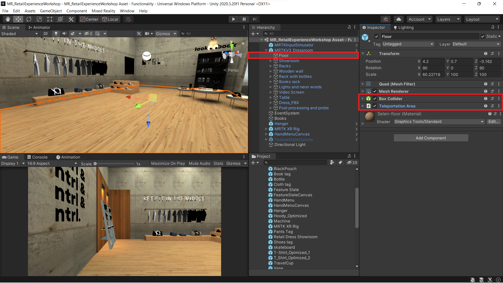
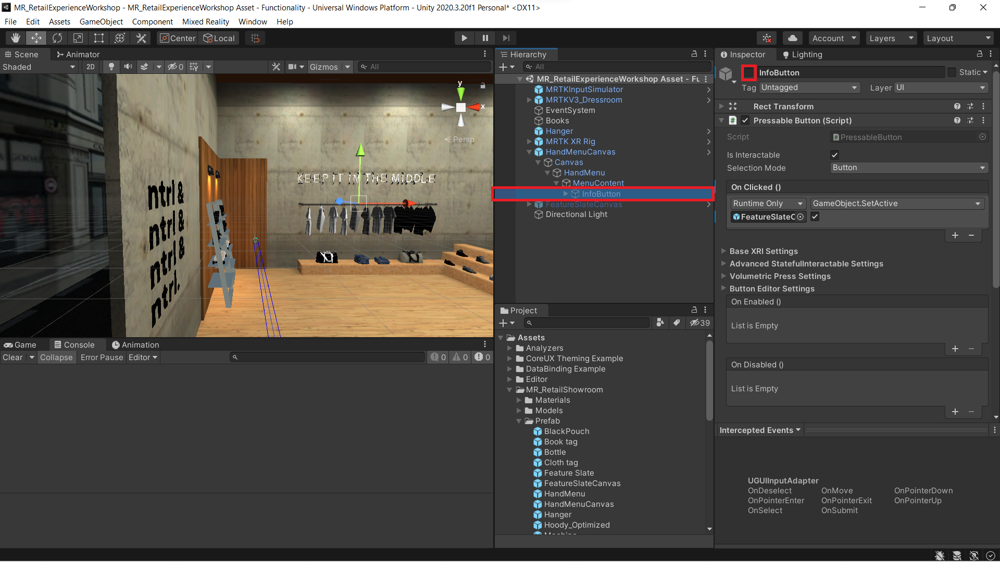
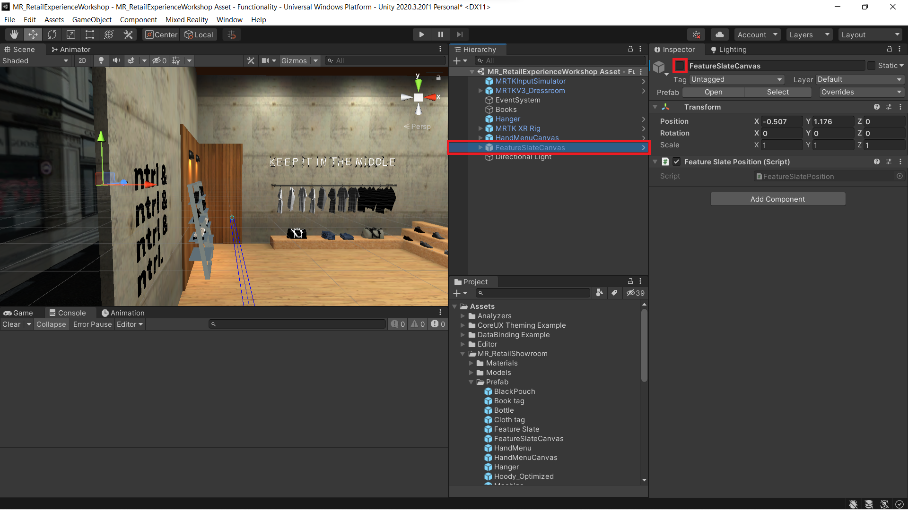

### [Previous Section: Configure Your Virtual Showroom With Interactivity](3-configure-virtual-showroom.md)

# Locomotion and Hand Menus

Locomotion is a movement that transports the users to their desired location. To incorporate locomotion in your project, follow the steps outlined below.

1. In the **Hierarchy** window, select the **MRTK XR Rig**. Then, in the **Inspector** window click on the **Add Component** button to add the following:

    - **Teleportation Provider**
    - **Snap Turn Provider**
    - **Locomotion System**
    - **Teleport Height**

    

2. In the **Inspector window**, select **Teleportation Provider** script, then to the **System** field drag and drop the **MRTK XR Rig**.

    

3. Select the **Snap Turn Provider** script and, to the System field, drag and drop the **MRTK XR Rig** as shown in the image.  

    

4. Now click on **Locomotion System**, drag and drop the **MRTK XR Rig** to the **XR Origin** field.

    

5. Select the **floor** GameObject, and in the **Inspector Window** add the following components:

    - Add a **Box Collider** to detect the floor for teleportation.
    - Add a **Teleportation Area** script

        

When testing the app later teleport by pointing the ray from your hands or controllers to the desired location that you would like to teleport to and perform the select gesture or trigger.

## Hand Menu and UI Slate

**Hand Menus**: MRTK3 offers built-in functionality to create custom hand menus. Hand menus provide users with convenient access to menu items whenever the palm of our hand is visible.

**Slate**: The Slate prefab offers a thin window for displaying 2D content such as text and images. It also includes a grabbable title bar and the ability to close the window.

This section walks you through implementation of both the hand menu and the slate.

1. From your project window, navigate to **Assets** > **MR_RetailShowroom** > **Prefab** and add the **HandMenuCanvas** and the  prefab to the hierarchy window. From the same folder, add the **FeatureSlateCanvas** prefab to the hierarchy window.

    

2. The slate's **title**, found under **FeatureSlateCanvas** > **Canvas** > **FeatureSlate** > **TitleBar** > **Content** > **Header**, can be customized by editing the text in the **TextMeshPro-Text component** . You can also edit the text content in the FeatureSlateCanvas by editing the TextMeshPro-Text component in **FeatureSlateCanvas** > **Canvas** > **FeatureSlate** > **Body** > **Content** > **MainText**. Feel free to copy the text below for the content.

    *Object Manipulator*

    *The Object Manipulator makes an object movable, scalable, and rotatable using one or two hands.*
  
    *Solvers*

    *Solvers are components that facilitate the means of calculating an object's position and orientation according to a predefined algorithm. Solvers offer a range of behaviors to attach objects to other objects or systems.*
  
    *Locomotion*
  
    *The locomotion system allows users to move and rotate in their environment using controller or hand inputs.*

    *Hand Menu*

    *MRTK3 offers built-in functionality to create custom hand menus. Hand menus provide users with convenient access to menu items whenever the hand palm is visible.*

    *UX Slate*
  
    *The Slate prefab offers a thin window for displaying 2D content such as text and images. It also includes a grabbable title bar and the ability to close the window.*

    *UX Buttons*

    *UX Buttons feature publicly exposed On Click function which drives the user in a specific direction allowing interactions to be performed without an actual scripting involved.*

    *Bounds Control*

    *To indicate that the hologram can be interacted with, a bounds control will display a box around it. Scaling, rotating, and translating the object is possible using the handles on the corners and edges of the box.*

    
        
    > **Note:** Adjust Font size so that the text fits. A value of 8 should be work nicely. 

3. Double-Click on the **HandMenuCanvas** prefab. In the **Hierarchy** window expand the objects until you reach the **InfoButton** object. This GameObject is visible in your scene as a blue button with an info icon. 

    

4. In the inspector window, expand **Pressable Button (Script)**  component and configure the **OnClicked ()** event as follows:

    - Click on the + icon to add the field and then, drag the **FeatureSlateCanvas** from the hierarchy to the None (Object) field

    - From the **No Function** dropdown list, select **GameObject** > **SetActive (bool)** to set this function as the action to be run when the event is triggered

    - Ensure that the **checkbox** is selected.

        

    >**Note:**
    > Step 5 and Step 6 may already be preconfigured in your project.

5. Next select **HandMenu** in the hierarchy, then in the **Inspector window**, configure the **Hand constraint** as follows:

    - Click the + icon in the **On First Hand Detected ()** field to add an event

    - Assign the **InfoButton** object to the None (Object) field.

    - From the **No Function** dropdown list, select **GameObject** > **SetActive ()** to set this function as the action to be run when the event is triggered

    - Verify that the argument checkbox is **checked**.

        

6. Configure the **On Last Hand Lost ()** as follows:

    - Click the "+" icon in the **On Last Hand Lost ()** field to add an event.

    - Assign the **InfoButton**, object to the **None (Object)** field.

    - From the **No Function** dropdown list, select **GameObject** > **SetActive ()** for the event to set this function as the action to be run when the event is triggered.

    - Verify that the argument checkbox is **unchecked**.

        

7. Select the **InfoButton** again. In the **Inspector** window **uncheck** the box next to the object's name. We do this so that the **InfoButton** is **hidden** until the user looks at their palm.

    

8. Repeat **Step 7** for the **FeatureSlateCanvas**. We do this so that the Feature slate stays hidden until the info button is pressed.

    
---
## [Next Section: Build and Deploy to HoloLens or Meta Quest](5-build-deploy.md)
