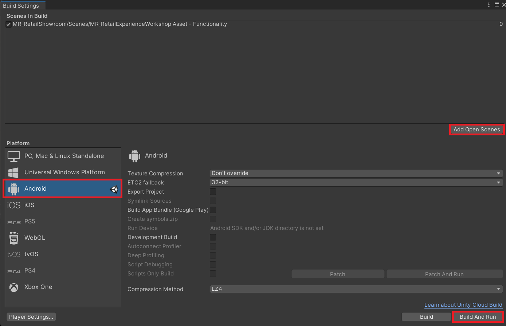

### [Previous Section: Locomotion and Hand Menus](4-locomoting-around-virtual-showroom.md)
# Build and Deploy to HoloLens or Meta Quest

## Build Your Application in Unity

1. In the menu bar, select  **File >**  **Build Settings**.

2. In the **Build Settings** window, click the **Add Open Scenes** button to add your current scene to the **Scenes In Build** list. You may need to remove any other scenes from your list if you have more than one scene (e.g., the default "SampleScene").

3. Confirm that you have switched the platform to **Universal Windows Platform**, as described in previous steps.

4. Click the **Build** button.  

5. In the **Build Universal Windows Platform window**, navigate to the folder where you want to store your build, or create a new folder and click the **Select Folder** button to start the build process.

>**Note:**
This section contains instructions to build for the HoloLens 2. Please skip to the second section if you are building to Meta Quest.

## Build for HoloLens 2

>**Note:**
You may test on the HoloLens 2 Emulator if you don't have a device.

1. When the build process has completed, **Windows File Explorer** opens and displays the build folder. Open the folder and then double-click the **solution file** to open it in Visual Studio.
.

    

2. Configure Visual Studio for HoloLens by selecting the **Master** or **Release** configuration and the **ARM64** architecture.

    

>**Note:**
For HoloLens, you'll typically build for the ARM architecture. However, there's a known issue in Unity 2019.3 that causes errors when selecting ARM as the build architecture in Visual Studio. As  a workaround, we recommend that you build for ARM64. If that isn't an option, in Unity, go to **Edit**  **Project Settings**  **Player**  **Other Settings** and disable Graphics Jobs.

>**Note:**
If you don't see "Device" as a target option in Visual Studio, you may need to change the startup project for the solution from the **IL2CPP project** to the **UWP project**. To do this, in the **Solution Explorer**, right-click **[your project name] (Universal Windows)** and then select Set as **StartUp** Project.

>**Important:**
Before building to your device, the device must be in **Developer Mode** and paired with your development computer. See the section named "Enabling Developer Mode" on this page.

1. Click the deployment target drop-down and then do one of the following: If you're building and deploying via Wi-Fi, select **Remote Machine**.

    

    If you're building and deploying via USB, select **Device**.

    

2. Set your remote connection: on the menu bar, select **Project**  **Properties**.

3. In the project's **Property Pages** window, select Configuration **Properties**  **Debugging**.

4. Click the **Debugger** to launch drop down and then select **Remote Machine** if it's not selected already

    [!Important]  
    We recommend that you manually enter your IP address rather than depend on the "Auto Detected" feature. To find your IP address, on your HoloLens, go to Settings  Updates & Security  For developers. The IP address is listed towards the bottom of the window under Ethernet.

5. In the **Machine Name field**, enter the **IP address** of your device.

6. Set the **Authentication Mode** to **Universal** (Unencrypted protocol)

7. Connect your HoloLens to your computer, and then in Visual Studio, do one of the following:
    - To deploy to your HoloLens and automatically start the app without the Visual Studio debugger attached, select **Debug**  **Start Without Debugging**.

    - To deploy to your HoloLens without having the app start automatically, select **Build**  **Deploy Solution**

    

### Pairing Your Device

The first time you deploy an app to your HoloLens from your PC, you'll be prompted for a PIN. To create a PIN:

1. In your HoloLens, go to **Settings**  **Updates & Security**  **For developers**.

2. Select Pair. This displays the **PIN** in the HoloLens.

3. Enter the PIN in the dialog in Visual Studio.

4. After pairing is complete, in the HoloLens, select Done. Your PC is now paired with your HoloLens and you can deploy apps automatically. Repeat these steps for every PC that's used to deploy apps to your HoloLens.  

### Running Your App on Your HoloLens

1. After your app finishes building, in the HoloLens Start menu, find the app tile for your app and select it.

2. After the app starts, enjoy trying a virtual retail showroom experience.

3. Use your ray pointers to interact with various objects in the showroom.

4. Try teleporting to various parts of the showroom.

## Build for Meta Quest

### Porting to Meta Quest

1. Ensure that your project is ready to deploy on the Quest device.

2. Ensure that **developer mode** is enabled on your device. Installing the **Meta ADB Drivers** is optional.

3. Ensure that your project settings are configured correctly to use the **Open XR pipeline** and **MRTK's feature set**. These features are required to deploy your project to Meta Quest.

4. Navigate to **File**  **Build Settings**

5. Now, under Platform, select **Android**. Then, switch the Platform to Android.

>**Note:**
To have the Android option enabled in the Build Settings Window, ensure that Android is checked while you download the respective unity version through Unity Hub.

### Build to Meta Quest

1. Once the porting is completed, Navigate to **Edit**  **Project Settings**

2. Now, under Project Settings, navigate to **XR Plug-in Management** and enable **OpenXR** under the **Android** tab. Ensure that **Initialize XR on Startup** is selected and that no feature groups are enabled.

    

3. In Project Settings, navigate to **XR Plug-in Management**  **OpenXR**  **Interaction Profiles** and Click on the + icon to add **Meta Touch Controller Profile**.

4. Again, Under Project Settings, navigate to **XR Plug-in Management**  **OpenXR**  **OpenXR Feature Groups** and ensure the following are checked under All Features.

    

5. In the **Project settings**, navigate to **Player** and set the **Company** and **Product** name.

     

6. Again, in the **Player settings**, expand **Other settings** and configure the following:

    - Remove the **Vulkan** option under the **Graphics API** section by selecting Vulkan and clicking on the – sign as highlighted in the image.

        

    - Set the **Minimum API Level to Android 7.0 ‘Nougat’(API level 24)** by selecting from the dropdown

        

    - Also, set the **Target API Level** to **Automatic (highest installed)** from the dropdown.
        

>**Note:**
Several red error icons and yellow warning icon may appear during this process. Click on the icon to open the OpenXR Project Validation tool and select Fix All to address the issues. You may need to do this several times.

>**Note:**
If you do not see Meta Quest Support under the OpenXR Feature Groups panel, make sure you've downloaded the Mixed Reality OpenXR Plugin via the MR Feature Tool.

### Deploying to Device

1. After you have the project configured, proceed to Generate Build. Navigate to **File**  **Build Settings**. Click on **Add Open Scenes** and later click on **Build** as highlighted in the picture. 

    

>**Note:**
Do not follow the Configure Settings instructions on Meta's documentation page. Their instructions require the use of the Meta Integration SDK, and uses the Meta XR Plug-in rather than the OpenXR Plug-in.

>**Tip**
If you select Build and Run in your build settings window, it will compile and deploy directly onto your Meta Quest.
