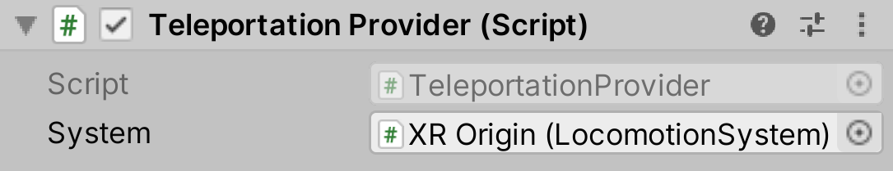

# Teleportation Provider

The `TeleportationProvider` is responsible for moving the XR Origin to the desired location on the user's request.

| **Property** | **Description** |
|--|--|
| **System** | The [LocomotionSystem](locomotion-system.md) that this `LocomotionProvider` communicates with for exclusive access to an XR Origin. If one is not provided, the behavior will attempt to locate one during its `Awake` call. |
