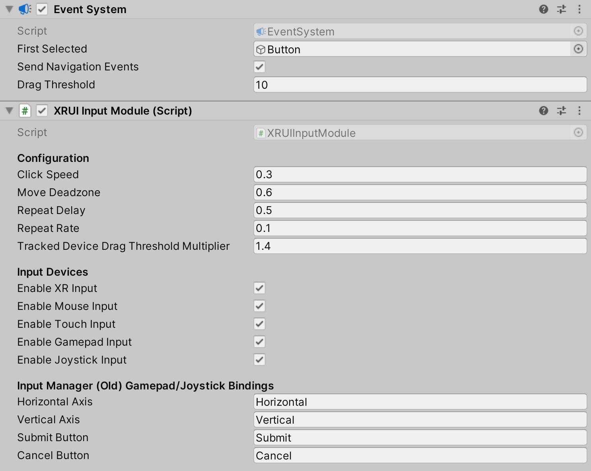

# UI interaction setup

To interact with Unity's built-in UI elements, you need to perform extra steps, particularly if you're dealing with 3D-tracked devices. The XR Interaction Toolkit package provides a number of new components that you can use to convert an XR controller to work seamlessly with the UI, as well as helper menu options that handle basic configuration settings.

## Using the GameObject menu

The XR Interaction Toolkit package comes with menu items that perform basic setup. Use these helpers to create a new UI Canvas. You can access them from the **GameObject &gt; XR** menu.

|Helper|Function|
|---|---|
|**UI Canvas**|Creates a new world-space Canvas that you can add standard UI elements to. If you haven't configured an Event System yet, it also creates and configures a new Event System for XR.|
|**UI EventSystem**|Creates a new Event System for XR, or modifies and selects the existing one in the loaded scenes.|

## Event System

The [Event System](https://docs.unity3d.com/Packages/com.unity.ugui@1.0/manual/EventSystem.html) component acts as a central dispatch for UI events to process input, and update individual active canvases. Additionally, each Event System needs an Input Module to process input. Use the default configuration, pictured below, as a starting point. Only one Input Module can be active at one time. The Tracked Device Physics Raycaster can also be added to a scene so that objects with physics colliders are able to receive Event System events from tracked devices.

> [!IMPORTANT]
> If you have an existing Canvas or Event System, you will likely have a **Standalone Input Module** or **Input System UI Input Module** component which will prevent proper input processing. Remove it by clicking the **More menu (&#8942;)** and selecting **Remove Component**. Other UI Input Modules are not compatible with the **XR UI Input Module** and may cause undesired or unexpected behavior. Therefore, only use a single Input Module to handle UI interactions.

> [!NOTE]
> **Known limitation**: When configuring the **XRUIInputModule**, gamepad and joystick input buttons are currently hard-coded to known values when using the new Input System. For the gamepad, the **submit** button is mapped to **buttonSouth** and **cancel** is mapped to **buttonEast**. The joystick **submit** button is mapped to the **trigger** and there is currently no support for the cancel button.

## Canvas
All UI elements exist in the canvas. In the XR Interaction Toolkit, a user can only interact with canvases that have their **Render Mode** set to **World Space**. The XR Interaction Toolkit package contains a new component (pictured below) called the Tracked Device Graphic Raycaster. This component lets you use 3D tracked devices to highlight and select UI elements in that canvas.

