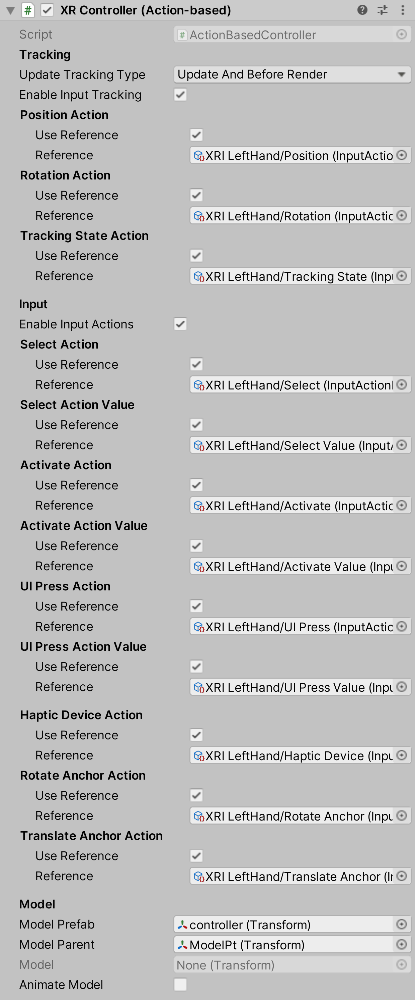

# XR Controller (Action-based)

Interprets feature values on a tracked input controller device using actions from the Input System into XR Interaction states, such as Select. Additionally, it applies the current Pose value of a tracked device to the transform of the GameObject.

This behavior requires that the Input System is enabled in the **Active Input Handling** setting in **Edit > Project Settings > Player** for input values to be read. Each input action must also be enabled to read the current value of the action. Referenced input actions in an Input Action Asset are not enabled by default.

| **Property** | **Description** |
|--|--|
| **Update Tracking Type** | The time within the frame that the controller samples tracking input. |
| &emsp;Update | Set **Update Tracking Type** to **Update** to sample tracking input only during the `MonoBehaviour` `Update` step. |
| &emsp;Before Render | Set **Update Tracking Type** to **Before Render** to sample tracking input only during the step immediately before rendering. |
| &emsp;Update And Before Render | Set **Update Tracking Type** to **Update And Before Render** to sample tracking input during both of the timings within a frame above. |
| **Enable Input Tracking** | Whether input pose tracking is enabled for the controller. When enabled, Unity reads the current tracking pose input of the controller device each frame. You can disable this in order to drive the controller state manually instead of from reading current inputs, such as when playing back recorded pose inputs. |
| **Position Action** | |
| &emsp;Use Reference | Enabling this turns on the input action in the accompanying reference field. |
| &emsp;Reference | The Input System action to use for Position Tracking for this GameObject. Must be a `Vector3Control` Control. |
| **Rotation Action** | |
| &emsp;Use Reference | Enabling this turns on the input action in the accompanying reference field. |
| &emsp;Reference | The Input System action to use for Rotation Tracking for this GameObject. Must be a `QuaternionControl` Control. |
| **Tracking State Action** | |
| &emsp;Use Reference | Enabling this turns on the input action in the accompanying reference field. |
| &emsp;Reference | The Input System action to get the Tracking State when updating this GameObject position and rotation; falls back to the tracked device's tracking state that drives the position or rotation action when not set. Must be an `IntegerControl` Control. |
| **Enable Input Actions** | Whether input for XR Interaction events is enabled for the controller. When enabled, Unity reads the current input of the controller device each frame. You can disable this in order to drive the controller state manually instead of from reading current inputs, such as when playing back recorded inputs. |
| **Select Action** | |
| &emsp;Use Reference | Enabling this turns on the input action in the accompanying reference field. |
| &emsp;Reference | The Input System action to use for Selecting an Interactable. Must be a `ButtonControl` Control. |
| **Select Action Value** | |
| &emsp;Use Reference | Enabling this turns on the input action in the accompanying reference field. |
| &emsp;Reference | The Input System action to read values for Selecting an Interactable. Must be an `AxisControl` Control. |
| **Activate Action** | |
| &emsp;Use Reference | Enabling this turns on the input action in the accompanying reference field. |
| &emsp;Reference | The Input System action to use for Activating a selected Interactable. Must be a `ButtonControl` Control. |
| **Activate Action Value** | |
| &emsp;Use Reference | Enabling this turns on the input action in the accompanying reference field. |
| &emsp;Reference | The Input System action to read values for Activating a selected Interactable. Must be an `AxisControl` Control. |
| **UI Press Action** | |
| &emsp;Use Reference | Enabling this turns on the input action in the accompanying reference field. |
| &emsp;Reference | The Input System action to use for UI interaction. Must be a `ButtonControl` Control. |
| **UI Press Action Value** | |
| &emsp;Use Reference | Enabling this turns on the input action in the accompanying reference field. |
| &emsp;Reference | The Input System action to read values for UI interaction. Must be an `AxisControl` Control. |
| **Haptic Device Action** | |
| &emsp;Use Reference | Enabling this turns on the input action in the accompanying reference field. |
| &emsp;Reference | The Input System action to use for identifying the device to send haptic impulses to. Can be any control type that will have an active control driving the action. |
| **Rotate Anchor Action** | |
| &emsp;Use Reference | Enabling this turns on the input action in the accompanying reference field. |
| &emsp;Reference | The Input System action to use for rotating the interactor's attach point. Must be a `Vector2Control` Control. Uses the X-axis as the rotation input. |
| **Translate Anchor Action** | |
| &emsp;Use Reference | Enabling this turns on the input action in the accompanying reference field. |
| &emsp;Reference | The Input System action to use for translating the interactor's attach point closer or further away from the interactor. Must be a `Vector2Control` Control. Uses the Y-axis as the translation input. |
| **Model Prefab** | The prefab of a controller model to show for this controller that this behavior automatically instantiates. This behavior automatically instantiates an instance of the prefab as a child of `modelParent` (see below) upon startup unless `model` (see further below) is already set, in which case this value is ignored. |
| **Model Parent** | The transform that this behavior uses as the parent for the model prefab when it is instantiated. Automatically instantiated and set in `Awake` if not already set. Setting this will not automatically destroy the previous object. |
| **Model** | The instance of the controller model in the scene. You can set this to an existing object instead of using `modelPrefab` (see above). If set, it should reference a child GameObject of this behavior so it will update with the controller pose. |
| **Animate Model** | Whether to animate the model in response to interaction events. When enabled, activates a named animation trigger upon selecting or deselecting. |
